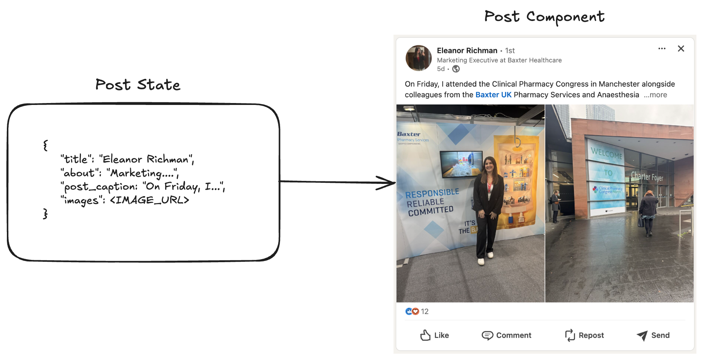
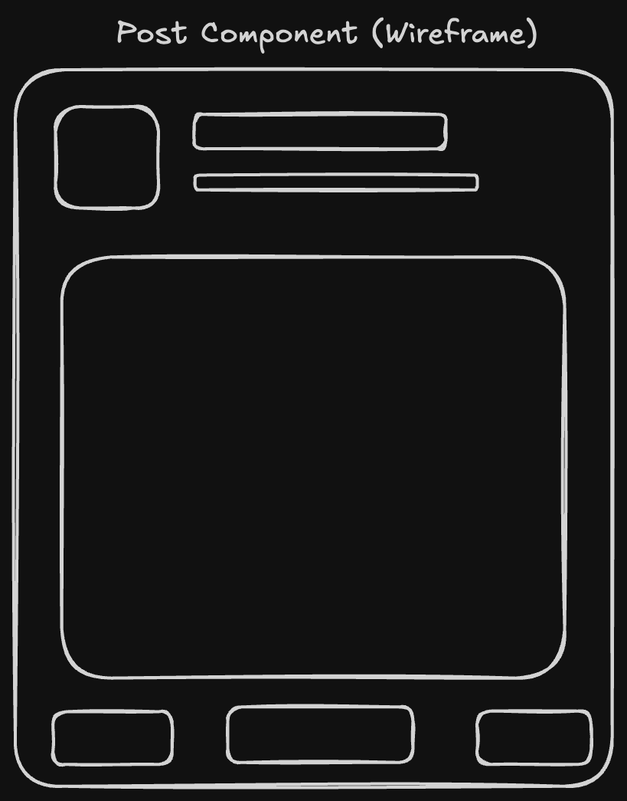

# DOM (Document Object Model)

1. DOM (Document Object Model) is the representation of the structure of a web page in the form of tree of objects. For e.g The `<html>` tag is parent to `<body>`, `<body>` is parent to `<div>` and so on. So this is a tree, heirarchical representation called DOM.

2. The DOM structures the HTML Document (Web Page) in a tree of documents, allowing the scripts (JS files) to manipulate the content on the page dynamically.

3. In a `Static HTML` as the name suggests, the HTML doesn't change. The contents visible on the web page remain as they are and there's no change in them. (Refer the `static.html` to understand)

4. If I want to explain the above point with an example, then consider a simple HTML code for making TODO lists. Then through it you can see the todos that are directly added in the HTML script, but when you enter a new todo in the text box and click the add todo button, nothing happens. (Again refer `static.html`)

5. Similarly, on the other hand in a `Dynamic HTML`, the initial HTML content we see is not the final and it gets updated based on the user activity. Suppose clicking a button might add a TODO, scrolling down a website and content gets automatically added and the end of the page etc.

6. So basically four functions can happen to make a web page dynamic, to read the content, to delete, to add, to update the content. For e.g Adding a new todo, deleting a existing todo, updating an existing todo or reading the new data given to make some processing over it.

7. The `document` object in the HTML is the root object, and refers to the whole HTML webpage. Basically it refers the `<html>` tag which is the root of the DOM heirarchy.

8. There are some predefined functions performed over the `document` object to make the HTML webpage dynamic. These functions basically do fetching, adding, deleting and updating the elements present in the webpage. Some of the prominent and useful functions are:

   - `querySelector()`:

     - This function basically fetches components on the HTML webpage.
     - So suppose in the function parenthesis if we put `"h1"` then the function will fetch out the first `<h1>` tag component present in the webpage.
     - This also can be used through the `id` or the `class` of the tag.
     - So if you want to fetch a component having id as `header` then we can define the component in this function as:
       ```javascript
       const h1 = document.querySelector("#header");
       ```
     - For class instead of `#` we should use `.` operator, and this function will fetch out the first component of the particular specified class.

   - `querySelectorAll()`:

     - This function is basically the same as the previous one just the difference is that instead of fetching the first single element it fetches out all the components of the specified tag, id or class.
     - One more caveat for this function is that since this function fetches a list of components of all the specified tag, id or class, we can implement indexing over it. (0 based indexing)
     - So suppose I want to access the 3rd element (2nd index) present in the list then I will do something like this:
       ```javascript
       const thirdComponent = document.querySelector("h1")[2].innerHTML;
       console.log(thirdComponent);
       ```

   - `innerHTML`:

     - This is not a function but just an attribute of these functions. This attribute just extracts the data inside of the specified component.

   - `removeChild()`:

     - This function is used to delete a specific child node of the curent node.
     - So suppose there are two `<div>` child nodes inside a parent `<div>` node then the element with specified ID would be deleted.
     - So this can be shown with an example as follows:

       ```html
       <body>
         <div id="todo-1">
           <h4>1. Todo 1</h4>
           <button onclick="deleteTodo()">Delete</button>
         </div>
         <div id="todo-2">
           <h4>2. Todo 2</h4>
           <button onclick="deleteTodo()">Delete</button>
         </div>
         <script>
           function deleteTodo(index) {
             var elementToDelete = document.querySelector("#todo-" + index); // select the component to be deleted
             var parent = elementToDelete.parentNode; // take out its parent
             parent.removeChild(elementToDelete); // delete the component through this parent
           }
         </script>
       </body>
       ```

   - `createElement()`:

     - This function creates an element outside the `document` object.
     - Hence this element (component) can't be found initially on the document structure of the webpage.

   - `appendChild()`:

     - This function appends a component as a child node to the current node.
     - Basically it adds a new component inside the current component.
     - Combining these two functions together as follows:
       ```html
       <html>
         <body>
           <div id="top-div">hi there!</div>
         </body>
         <script>
           var divEl = document.createElement("div"); // create a new element
           divEl.innerHTML = "hi there pt.2"; // some content inside the new element
           let parent = document.querySelector("body"); // selecting the parent node i.e the body
           parent.appendChild(divEl); // adding this newly created element to the webpage
         </script>
       </html>
       ```

   - `setAttribute()`:
     - It sets an attribute to a newly create or previously existing element dynamically.
     - It takes two parameters, one is the name of the attribute and other is the value of the attribute.
     - This can be shown in the code as follow:
       ```javascript
       const newElement = document.createElement("div");
       let value = 1;
       newElement.setAttribute("id", value); // name of the attribute is "id" and value is 1
       ```

## State Derived Frontends:

1. To make frontends easier to code the concept of `state` came into the picture. When we'll learn `React.js` this will be more clear to understand.

2. The 3 important `jargons` to understand in it are:

- `State`:

  - This is the variable part present on the application.
  - For e.g In **LinkedIn**, for the posts, the name of the person who posted, profile picture, title of the post, images in the post are variable. These things will change from person to person.
  - All these variable things are referred to as state.

- `Components`:

  - The rendering of the states on the screen is referred to as components.
  - For e.g In **LinkedIN** posts, the structure of the post is the same, the font of the username, title etc is same, the color of the post card, margin & corners, buttons present on the post, effects on the post(such as hovering) are all the same.
  - The state data is just added according to the components set. So the way the states are rendered onto the application are called as components.



- This image shows that basically the component is the actual part of the application, and state the is dynamic data that is filled out in these components differentiating from user to user.

- The component is the wireframe (a blueprint, or a raw structure) in which the dynamic state data is inserted. An application can have multiple components, suppose in this case of LinkedIN, the posts, the titlebar etc are all the components.

- The state can be observed as a JSON, containing data for a particular field or context.



- So if we apply the state to this kind of wireframe (component) then the final outcome would be something like a LinkedIN post as we can see in the first image.

- `Rendering`;

  - This means taking the `state` data and putting it inside the `component` to show it over the `DOM`.
  - Rendering basically means printing something, and here we want to print (show) the component with its state on the DOM (web app in easier words).
  - So combining state and component and showing it on the DOM is rendering.

3. In the `app` directory we tried to develop a todo application using the regular method to poulate `DOM`. Similarly in the `app2` directory we've implemented the concept of using `state & components` method to write the frontend of the todo application. The difference can be seen clearly.

4. Basically the code written in the `app2` project is the way (most likely), react code is written too.
