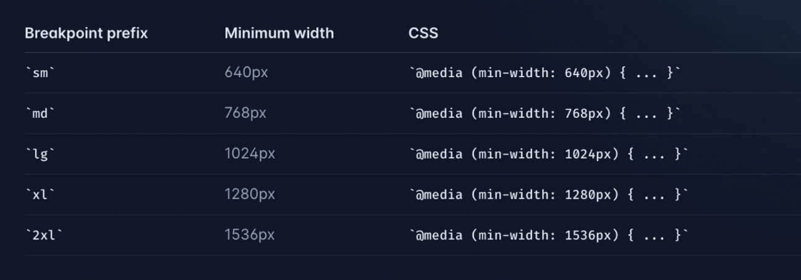

# TailwindCSS

1. Things to know in a frontend framework:

   - _Flex_: The way of aliging the items in a various places of the webpage.
   - _Grid_: Same as flex for aligning the items.
   - _Responsiveness_: Adaptation of the website to different screen sizes.
   - _Background Color, Text Color, Hover_: The colors of the background, textual data shown on the screen and visual effects & animations added when any action performed.

2. We use the `className` attribute to set TailwindCSS classes in the tags while returning from a component function. Inside this `className` attribute we can add multiple CSS classes as we want to style the component.

3. Let's go with each sub topic by topic and then see what classes each topic has to offer to show things in a different manner.

4. **Flex**:

   - To implement this we use the `flex` class. This makes the child elements inside the `div` place right next to each other.
   - Now to align the elements in a specific place in using the flex, we can use the `justify` classes.
   - `justify`, this aligns all the elements to the left of the page.
   - `justify-right`, this aligns all the elements to the right of the page.
   - `justify-center`, this aligns the elements to the center of the page.
   - `justify-space-between`, this takes the full width of the parent div, and aligns the children with equal space between them.
   - `justify-space-around`, this also takes the full width of the parent div, though this keeps an equal amount of space around the children.
   - An example of code would look like,

   ```tsx
   function App() {
     return (
       <div className="flex justify-content-around">
         <div className="bg-blue-300">child 1</div>
         <div className="bg-red-300">child 2</div>
         <div className="bg-green-300">child 3</div>
       </div>
     );
   }
   ```

5. **Grid**:

   - To implement this we use the `grid` class and it's associate classes. This too sets the child elements in the side by side fashion, but this works a little differently.
   - This class divides the parent div into specific number of grids as entered by the developer. Specifying the grids can be done using the `grid-cols-12` class, in this class we have specified 12 grids.
   - The children can take up the space in the grid based on their span defined. This can be done using the `cols-span-5` class, in this example the child would take 5 grids.
   - Example code would something look like,

   ```tsx
   function App() {
     return (
       <div className="grid grid-cols-12">
         <div className="bg-blue-300 col-span-5">first div</div>
         <div className="bg-red-300 col-span-2">second div</div>
         <div className="bg-green-300 col-span-5">third div</div>
       </div>
     );
   }
   ```

6. **Responsiveness**:
   - This means the adaptability of the page based on the changing of the screen size on which the webpage is being visited.
   - There are various breakpoints (classes) for this based on the different types of the screens present.
   - Following image depicts the breakpoints and the size of the screen in pixels (px).
     

## Installation:

1. We can create a new React Project and then configure Tailwind settings into it following these steps, the command below installs `tailwindcss` as a dev-depency along with `postcss` and `autoprefixer`.

```bash
npm install -D tailwindcss postcss autoprefixer
```

2. Now we run the second command, this command will create new `tailwind.config.js` & `postcss.config.js` in our project folder.

```bash
npx tailwindcss init -p
```

3. The `tailwind.config.js` contains all the configurations regarding `TailwindCSS` in our project. This file something looks like the one below, the content array tracks the folders where the tailwind code would be present and adds the CSS for them accordingly.

```javascript
/** @type {import('tailwindcss').Config} */
export default {
  content: ["./index.html", "./src/**/*.{js,ts,jsx,tsx}"],
  theme: {
    extend: {},
  },
  plugins: [],
};
```

4. Finally add these lines of code in either `index.css` or `App.css`:

```css
@tailwind base;
@tailwind components;
@tailwind utilities;
```
